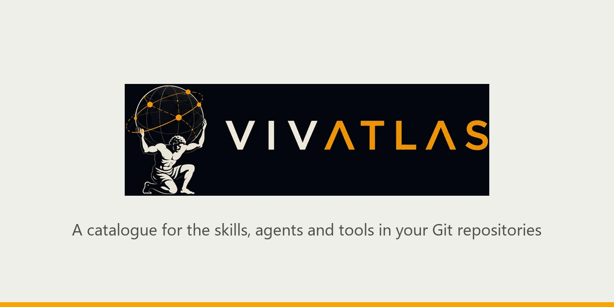
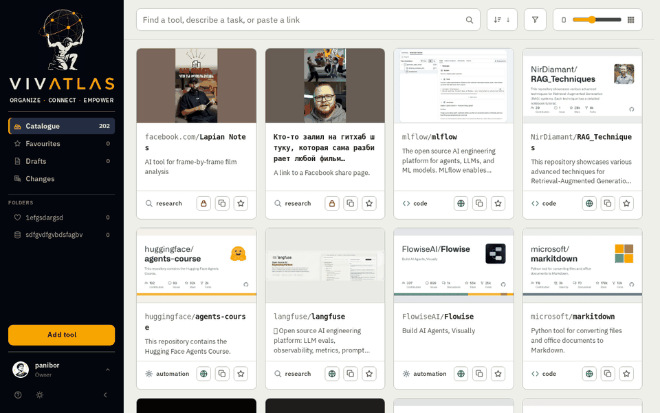
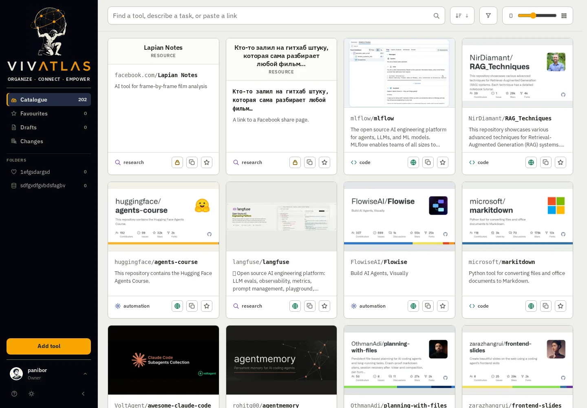
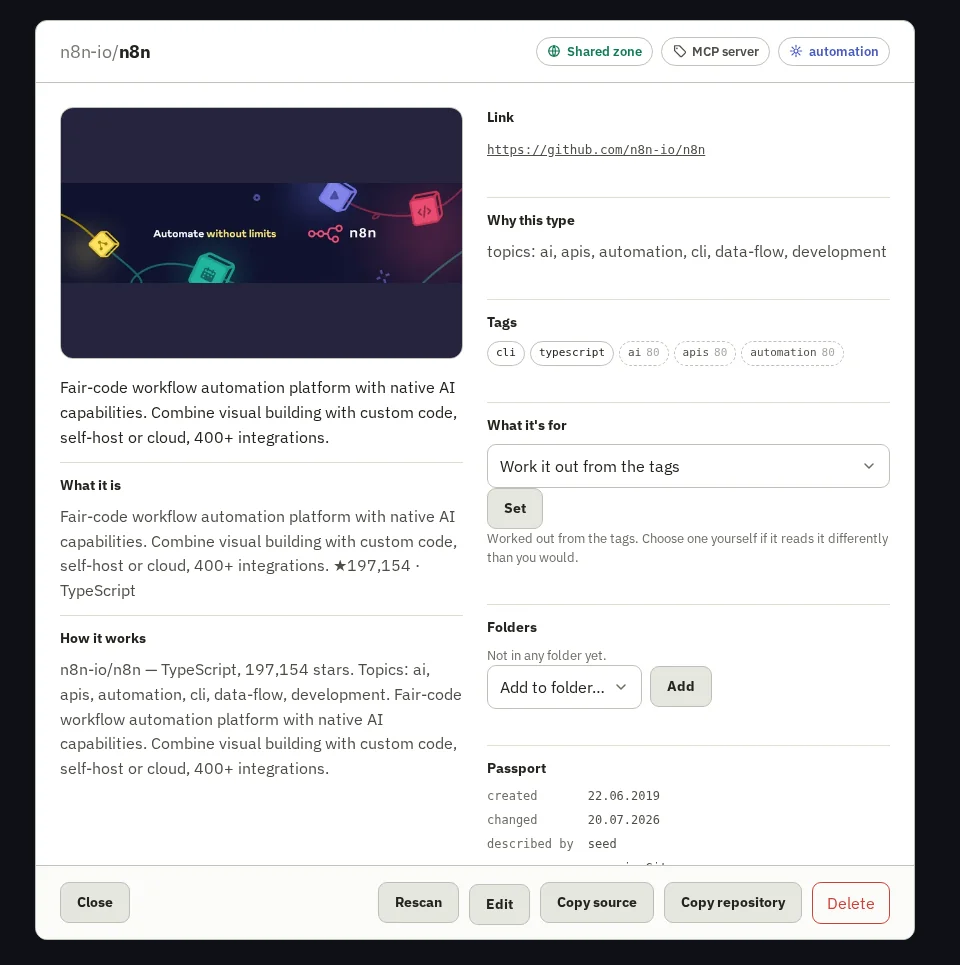
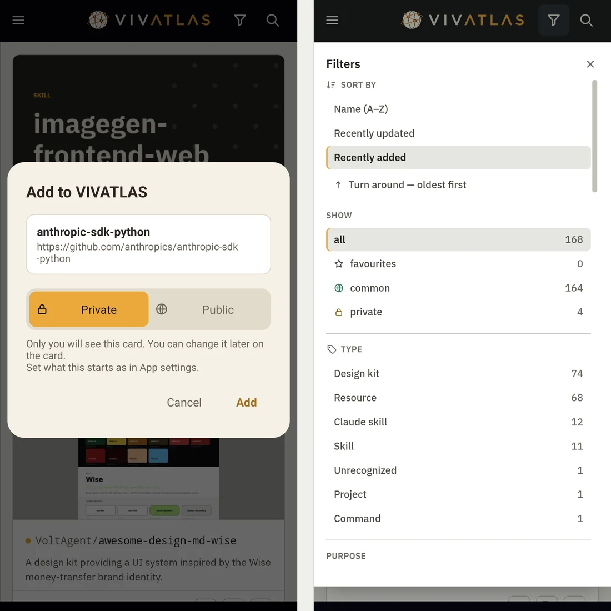

<p align="center">
  
</p>

# VIVATLAS

You collect tools. Skills for Claude, agents, MCP servers, a scraper you starred at midnight, a design kit somebody linked on Reddit. They end up scattered across GitHub stars, a self-hosted Gitea, browser bookmarks and a notes app — and three months later you remember *there was a thing for that* and can't find it.

VIVATLAS is the shelf. Point it at your repositories and the links you clip, and it turns each one into a card: a name, a description written for a person rather than a compiler, a picture, tags. Then it puts them all in one place you can search by *meaning*, not just by name. Ask it for "something that audits a site for accessibility" and it hands you three candidates and tells you why.

It runs on your own machine — a NAS, a spare box, a laptop — it's built for more than one person, and it only ever *reads*. Public repositories in, nothing written back to Git, ever.

<p align="center">
  
</p>

## What it does for you

### Every card has a face

<p align="center">
  
</p>

Nobody browses a wall of grey rectangles. VIVATLAS finds each project's own picture — the banner at the top of its README, a logo in the repo, or the card GitHub draws for it — and throws out the things that only *look* like pictures: build badges, sponsor logos, "buy me a coffee" buttons, the owner's avatar. When a project has several real candidates, the same AI that writes the description looks at them side by side and picks the one that actually shows the thing.

And when a project has nothing at all, VIVATLAS draws a cover itself — the name set in the house typeface on a colour and a pattern that come from the name, so every cover is different and they all belong together. No model, no cost, never grey.

<p align="center">
  
</p>

### A card, up close

Open one and you get the same project three ways: a one-liner, a paragraph for a person, and a technical note for when you're deciding whether to use it. Tags with their confidence, what it's for, where it came from and when it last changed — and the buttons to rescan it, file it, or copy the link. The descriptions are written by whichever AI you've configured, from the repository's own README.

<p align="center">
  
</p>

### Search the way you'd ask a colleague

Two indexes work together: full-text for words, vectors for meaning. Type in Russian and find an English tool. Describe a task instead of naming a tool, and the recommender returns three options with a sentence each on why — or an honest "nothing here fits", which is rarer in software than it should be.

### Clip from anywhere

- **Browser extension** (Chrome and friends): the page you're on, or a pasted link, into your catalogue in one click, public or private. → [extension/README.md](extension/README.md)
- **Android app**: Share → VIVATLAS from any app. A small sheet shows what you're saving and lets you choose *private* or *public* before it goes. Signs in by scanning a QR from a browser that's already signed in, so a long password never meets a phone keyboard. → [android/README.md](android/README.md)
- **The web form**: a link, a site, a screenshot or a reel → candidates with stars → pick → import.

<p align="center">
  
</p>

### Yours, theirs, everyone's

Each person has their own sign-in, their own private cards and personal folders. The shared catalogue is common to all and curated by whoever runs the place. A card can move between the two — it's the owner's call — and you can keep favourites, watch a feed of what changed, and see which cards have gone stale upstream.

### Ask it from your AI assistant

VIVATLAS is an MCP server. Connect it to ChatGPT, Claude, or anything else that speaks MCP, and "which of my tools does X?" gets answered from *your* catalogue. There's a plain REST API too. → [docs/MCP.md](docs/MCP.md)

### The rest, briefly

Three languages (English, Russian, Hebrew — right-to-left done properly). Light, dark, OLED and follow-the-system themes. Two-step sign-in with backup codes. Invitations by link or email, or open registration if you prefer. Gitea and GitHub as sources, rescanned daily. An admin panel for people, folders, email and AI keys — all changeable without a restart. And `upstream` / `update`, which compare a card with where it came from and bring in a new version only where you haven't touched the file.

## Try it in five minutes

The quickest way is the container:

```bash
docker run -d --name vivatlas -p 8710:8710 -v vivatlas_data:/data ghcr.io/bobpanil/vivatlas:latest
```

Open `http://localhost:8710`, and the first person through `/setup` becomes the owner. Then **Admin → Sources**: give it a GitHub account or a Gitea address, press *Scan now*, and watch the cards arrive.

Running from source instead:

```bash
python -m venv .venv
.venv/bin/python -m pip install -e ".[dev]"        # Windows: .venv\Scripts\python.exe
cp .env.example .env                               # set SECRET_KEY; everything else is optional

.venv/bin/python -m vivatlas.cli init-db           # create or update the database
.venv/bin/python -m vivatlas.cli scan              # fetch repositories
.venv/bin/python -m vivatlas.cli serve --host 0.0.0.0 --port 8710
```

`--host 0.0.0.0` lets a phone on the same Wi-Fi reach it. After updating the code, run `init-db` again — `serve` doesn't migrate on its own (the container does, on every start).

For a proper home, there's a walkthrough for **TrueNAS SCALE** in [docs/DEPLOY-TRUENAS.md](docs/DEPLOY-TRUENAS.md) — it also covers the two settings that matter once VIVATLAS sits behind a proxy or a tunnel.

## Settings you might actually want

Everything optional lives in `.env` (or the container's environment); [.env.example](.env.example) annotates the lot. The ones people ask about:

| Setting | What it's for |
|---|---|
| `GOOGLE_API_KEY`, `OLLAMA_URL` | The AI that writes descriptions and picks pictures. Either works; both is fine. Also settable in the admin panel. |
| `TRUSTED_PROXIES` | If Cloudflare, Traefik or nginx terminates TLS in front of VIVATLAS. Without it, cookies go out without `Secure`. |
| `IMAGE_MODEL` | Have pictures *drawn* for cards that offer none — a Google image model (needs billing) or `pollinations:flux` (free, keyless, soft). Empty means the designed covers, which is the default and looks better than you'd think. |

## The rules it lives by

**VIVATLAS is a viewer, not an owner.** It reads public Git repositories and helps you find and view the tools inside them. It does not own — and claims no rights in — any of the repositories, code, names or trademarks it catalogues or links to. Those belong to their authors and are governed by their own licences.

**It writes nothing to Git and does not scan private repositories.** That's a rule, not a setting: there's no toggle for it anywhere.

**Licence:** [Business Source License 1.1](LICENSE) — free to use, deploy and modify, including commercially; you may not sell or resell VIVATLAS itself as a product or a hosted service. It converts to Apache-2.0 on 2030-07-21.

## Tests

```bash
.venv/bin/python -m pytest
.venv/bin/python -m ruff check src tests
```

<details>
<summary><b>Under the hood</b> — where things live, for when you want to change something</summary>

```
src/vivatlas/
  config.py            settings from .env
  runtime_settings.py  overrides from the database on top of .env (edited from the admin panel)
  db.py                connection to SQLite
  models.py            tables
  migrate.py           init-db: add missing columns/indexes, rebuild search
  security.py          passwords, secret encryption, secret key
  twofactor.py         two-step sign-in (TOTP + backup codes)
  auth.py, auth_web.py sign-in, registration, invitations, password reset
  qrlogin.py           sign a phone in by a one-time QR shown on a signed-in browser
  admin_web.py         admin panel (people, access, email, integrations)
  settings_web.py      personal settings, avatars, sources, folders
  web.py               catalogue, cards, adding
  api.py               app assembly, REST, background loops, static
  filters.py           visibility: own + shared
  categories.py        folder permissions (shared/personal)
  i18n.py, translations*.py   translations (en/ru/he), RTL
  mailer.py            emails (password reset, invitations)
  avatars.py           uploaded photo → square WebP
  previews.py          the picture on a card: find it, fetch it, fit it — or draw a cover
  ai/                  the models: google.py (text, vision, images), ollama.py, pollinations.py
  usericons.py         default avatar set (static/usericons)
  scanner.py, indexer.py  scanning + the private-repo rule, index
  mcp_server.py        MCP server for AI assistants
  cli.py               terminal commands (init-db, scan, serve, previews, embed, upstream…)
  providers/
    base.py            common interface to a Git host (the "socket")
    gitea.py           Gitea
    github.py          GitHub (an account's public repositories)
  ext_api.py           JSON API for the browser extension and the Android app (/api/ext)
  templates/, static/  pages and styles (hand-written CSS, no build step)

extension/             Chrome/Chromium extension (Manifest V3)
android/               Kotlin WebView shell: share target, QR sign-in
```

Adding another Git host: implement the `providers/base.py` interface in a new provider and wire it in `providers/__init__.py`. The rest of the code stays the same.

</details>
